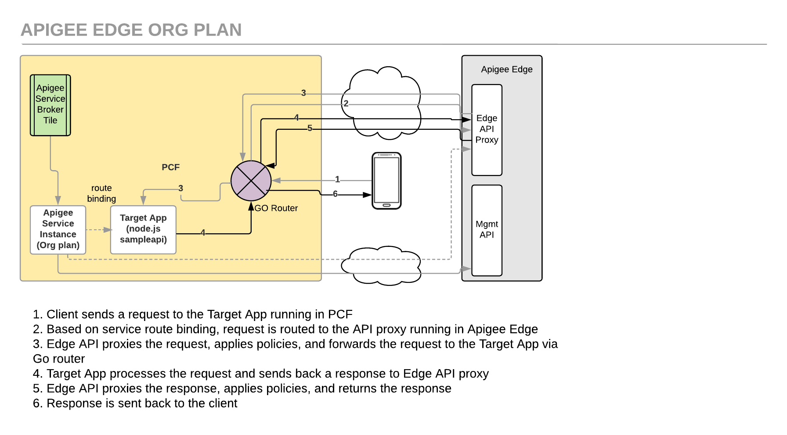

# Apigee Edge Service Broker Org Plan: Secure a CF App

*Duration : 20 mins*

*Persona : API Team*

# Use case

You have an API Created in Pivotal Cloud Founday. You want to proxy it through Apigee Edge.



# How can Apigee Edge help?

The [Apigee Edge Service Broker for PCF](https://docs.apigee.com/api-platform/integrations/cloud-foundry/install-and-configure-apigee-service-broker) enables developers to manage APIs for their PCF apps through the Apigee Edge management console.

This lab describes how to push a sample app to Pivotal Cloud Foundry (PCF), create an Apigee Edge service instance, and bind the application to it. After binding the application to the Apigee Edge service instance, requests to the app will be forwarded to an Apigee Edge API proxy for management. Its the same lab as listed in [PCF documentation](https://docs.apigee.com/api-platform/integrations/cloud-foundry/proxying-cloud-foundry-app-org-plan)


# Pre-requisites

* You have [installed and configured](http://docs.pivotal.io/partners/apigee/installing.html) the *Apigee Edge Service Broker for PCF tile*. Or you got a set of credentials from your instructor that has access to a PCF environment with *Apigee Edge Service Broker for PCF* tile. 

* You have installed [cf CLI](https://docs.cloudfoundry.org/cf-cli/install-go-cli.html).

* You have an Apigee account and have access to an Apigee Org.

# Instructions

Before you begin, you will need to get the following from your PCF instance or receive them from your instructor.

YOUR-SYSTEM-DOMAIN: This the the domian/hostname where the PCF is deployed. If you are using self signed certs for this endpoint, you will have to use `--skip-ssl-validation` for some of the commands

PCF_USERNAME: PCF username

PCF_PASSWORD: PCF Password

PCF_ORG: The instance of your PCF deployment. If you are familiar with PCF, you may just refer to this as ORG. Since Apigee also as a concept of ORG, we will call this PCF_ORG for this lab

PCF_SPACE: An org can contain multiple spaces. This is the space you will pick for this lab

PCF_API: PCF API Endpoint

PCF_DOMAIN: PCF Domain for your apps. 

# Steps

**1. Push the sample application as a CF app to PCF**

   a. Clone the Apigee Edge GitHub repo:
    
    $ git clone https://github.com/apigee/cloud-foundry-apigee.git

   b. Change to the *org-and-microgateway-sample* directory of the cloned repo:
    
    $ cd cloud-foundry-apigee/samples/org-and-microgateway-sample

   c. In the *org-and-microgateway-sample* directory, edit *manifest.yml* and change the following parameters:
   
   * **name**: {your_initials}-sampleapi
   * **host**: {your_initials}-sampleapi
```
  applications: 
  - name: {your_initials}-sampleapi
    memory: 128M 
    instances: 1 
    host: {your_initials}-sampleapi
    path: . 
    buildpack: nodejs_buildpack
```
   d. Set your API endpoint to the Cloud Controller of your deployment
    
    $ cf api --skip-ssl-validation https://api.system.apigee-demo.net
```
Setting api endpoint to https://api.system.apigee-demo.net...
OK

api endpoint:   https://api.system.apigee-demo.net
api version:    2.82.0
```
   e. Log in to your deployment and select an org and a space
    
    $ cf login
    -or-
    $ cf login -u {PCF_USERNAME} -p {PCF_PASSWORD}
```
API endpoint: https://api.system.apigee-demo.net

Email> sandeepmuru+pivotal+labuser3@google.com

Password> 
Authenticating...
OK

Targeted org apigee

Targeted space sandeepmuru+pivotal+labuser3@google.com

API endpoint:   https://api.system.apigee-demo.net (API version: 2.82.0)
User:           sandeepmuru+pivotal+labuser3@google.com
Org:            apigee
Space:          sandeepmuru+pivotal+labuser3@google.com
```
   You can also select the org and space through the following command
    ```
    $cf target -o $PCF_ORG -s $PCF_SPACE
    ```

   f. Push the sample app to PCF:
    
    From within the *org-and-microgateway-sample* folder run:
    
    $ cf push
    
    If successful, you should see some output from this command and finally:
```
     state     since                    cpu    memory          disk          details
#0   running   2018-04-25 02:50:40 PM   0.0%   56.3M of 600M   46.5M of 1G
```

   g. Get a list of apps to determine the URL of the app just pushed:
    
    $ cf apps
```
Getting apps in org apigee / space sandeepmuru+pivotal+labuser3@google.com as sandeepmuru+pivotal+labuser3@google.com...
OK

name                        requested state   instances   memory   disk   urls
hm-sampleapi                started           1/1         600M     1G   hm-sampleapi.apps.apigee-demo.net
```

   h. Use curl to send a test request to the url of the running app. Verify the response from the app. 
    
    $ curl hm-sampleapi.apps.apigee-demo.net
```
{"hello":"hello from cf app"}
```

**2. Install the Apigee Broker Plugin**

   a. Run the CF install-plugin command
   
   $ cf install-plugin -r CF-Community "apigee-broker-plugin"
```
Installing plugin Apigee-Broker-Plugin...
OK
Plugin Apigee-Broker-Plugin 0.1.1 successfully installed.
```
   b. Make sure the plugin is available by running:

    $ cf -h
```
...
Commands offered by installed plugins:
  apigee-bind-mg,abm     apigee-push,ap           apigee-unbind-org,auo
  apigee-bind-mgc,abc    apigee-unbind-mg,aum     
  apigee-bind-org,abo    apigee-unbind-mgc,auc  
```

**3. Create a Service Instance**

   a. List the Marketplace services and locate the Apigee Edge service:
    
    $ cf marketplace
```
Getting services from marketplace in org apigee / space sandeepmuru+pivotal+labuser3@google.com as sandeepmuru+pivotal+labuser3@google.com...
OK

service       plans                                        description
apigee-edge   org, microgateway, microgateway-coresident   Apigee Edge API Platform
```
   b. Create an instance of the Apigee Edge service. Select the *org* service plan.
```
   $ cf create-service apigee-edge org {your_initials}_apigee_service -c '{"org":"amer-api-partner19","env":"test"}'

Creating service instance hm_apigee_service in org apigee / space sandeepmuru+pivotal+labuser3@google.com as sandeepmuru+pivotal+labuser3@google.com...
OK
```

   c. Use the cf service command to display information about the service instance:
```
   $ cf service {your_initials}_apigee_service

Showing info of service hm_apigee_service in org apigee / space sandeepmuru+pivotal+labuser3@google.com as sandeepmuru+pivotal+labuser3@google.com...

name:            hm_apigee_service
service:         apigee-edge
bound apps:      
tags:            
plan:            org
description:     Apigee Edge API Platform
documentation:   
dashboard:       https://enterprise.apigee.com/platform/#/
...
```

**4. Bind the Sample CF App created in Step 1 to route its requests to the Apigee Egde Service Instance created in Step 3.**

   The apigee-bind-mg command creates a proxy for you and binds the app to the service.

    $ cf apigee-bind-org --app {your_sample_app_name} --service {your_service_instance} --apigee_org amer-api-partner19 --apigee_env test --domain apps.apigee-demo.net --user sandeepmuru+pivotal+labuser3@google.com --pass Apigee123

   The above command will promt for these entries. Enter the values as listed below:

   Action to take ("bind", "proxy bind", or "proxy") [required]: proxy bind
   Target application protocol [optional]: https

**6. Test the binding**
   
   Once you’ve bound your app’s path to the Apigee service (creating an Apigee proxy in the process), you can try it out with the sample app.

   This time Trace the API proxy from the Apigee Edge management console.
   * Login using the Apigee Org credentials given to you.
   * In the management console, under APIs > API proxies, locate the name of the proxy you just created with bind-route-service. It will have a name of cf-{your-initials}-sampleapi.apps.apigee-demo.net
   * Click the new proxy’s name to view its Overview page.
   * Click the Trace tab, then click the Start Trace Session button.

   * From a command line run the curl command you ran earlier to make a request to your Cloud Foundry app you pushed, such as:
```
   $ curl http://{your_sample_app_name}.apps.apigee-demo.net

   You should see the following response as before:

    {“hello”:“hello from cf app”}
```
    
**Congratulations!**...
    
    What does this mean
    - You have analytics across all your APIs, created through PCF
    - You can now add authentication, traffic management and other capablities to your API
    - When you do that the business teams can create API Products, and scale the consumption
    - If you have swagger spec for this API, you can enable your developers to access these APIs through smartdocs

# Summary

In this lab you have added API Management to an API created in PCF using Apigee Edge.

# References

* [Installing Apigee Edge Service Broker for PCF tile]
    (http://docs.pivotal.io/partners/apigee/installing.html)


