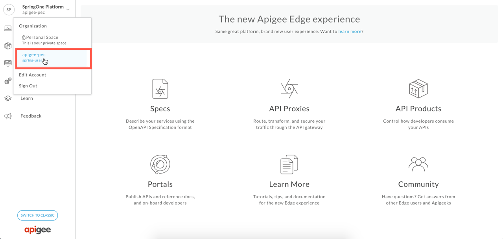

# Apigee Edge Service Broker Org Plan: Secure a CF App

*Duration : 20 mins*

*Persona : API Team*

# Use case

You have an Application / API Created in Pivotal Cloud Foundry. You want to secure it through a proxy in Apigee Edge.


# How can Apigee Edge help?

The [Apigee Edge Service Broker for PCF](https://docs.apigee.com/api-platform/integrations/cloud-foundry/install-and-configure-apigee-service-broker) enables developers to manage APIs for their PCF apps through the Apigee Edge management console.

This lab describes how to push a sample app to Pivotal Cloud Foundry (PCF), use an already created Apigee Edge service instance, and bind the application to it. After binding the application to the Apigee Edge service instance, requests to the app will be forwarded to an Apigee Edge API proxy for management. Its the same lab as listed in [PCF documentation](https://docs.apigee.com/api-platform/integrations/cloud-foundry/proxying-cloud-foundry-app-org-plan)


# Pre-requisites

* You have [installed and configured](http://docs.pivotal.io/partners/apigee/installing.html) the *Apigee Edge Service Broker for PCF tile*. Or you got a set of credentials from your instructor that has access to a PCF environment with *Apigee Edge Service Broker for PCF* tile. 

* You have installed [cf CLI on a Unix/Linux based machine](https://docs.cloudfoundry.org/cf-cli/install-go-cli.html) in your laptop.

**Windows users:** Ensure you can execute Google Cloud Shell to [install cf cli following these steps](https://gist.github.com/dzuluaga/a5f42e343dad0198d052df8b2c35a45e).

# Instructions

**1. Use username/password from the handout**

**2. Set environment variables:** Before you begin, you will need to set the environment variables of your PCF foundation. <a href="https://apigeespringone.page.link/apigee-pcf-environment" target="_blank">Download apigee-pcf-environment.sh</a>.

**3. Replace values for** `PCF_USERNUM and PCF_PASSWORD`, variables from the handout.

   **a. Save apigee-pcf-environment.sh**
   
   Example of environment variables. 
   
   ```bash
   # apigee-pcf-environment.sh file
#
# Please edit values for PCF_USERNUM and PCF_PASSWORD -  where XXX is your unique identifier
export PCF_USERNUM=CHANGE_ME
export PCF_PASSWORD=CHANGE_ME

# Apigee Credentials from registration sheet above
export PCF_USERNAME=apigee-pcf-user-$PCF_USERNUM
export APIGEE_ORG=apigee-pec
export APIGEE_ENV=test
export APIGEE_USERNAME=springone18@gmail.com
export APIGEE_PASSWORD=ASK_FOR_IT
export EDGEMICRO_KEY=6f70f4c24077058b45464606b788a854f3631a8c57ca3cc0ed144917a33f0e1a
export EDGEMICRO_SECRET=24173cbee9a078f5d2947dbcf5998724e2139e195e8f9efbcb3b3447869d4a0d

# The instance of your PCF deployment. If you are familiar with PCF, you may just refer to this as ORG. Since Apigee also as a concept of ORG, we will call this PCF_ORG for this lab and your ORG for this lab is called - "group-apigee"
export PCF_ORG=group-apigee

# An org can contain multiple spaces. The space you will pick for this lab is called - "apijam"
export PCF_SPACE=apijam

# PCF API Endpoint - e.g. - https://api.run.pcfone.io
# This the the domain/hostname where the PCF is deployed. If you are using self signed certs for this endpoint, you will have to use `--skip-ssl-validation` for some of the commands
export PCF_API=https://api.run.pcfone.io

# PCF Domain for your apps.  // e.g. - apps.pcfone.io
export PCF_DOMAIN=apps.pcfone.io

#
export PCF_ORG_SERVICE_INSTANCE=apigee-org-service
export PCF_MGW_SERVICE_INSTANCE=apigee-microgateway-service
export PCF_COR_SERVICE_INSTANCE=apigee-coresident-service
   ```
   
   **b. run `source apigee-pcf-environment.sh` to see these environment variables.** 
   
   **c. Clone the Apigee Edge GitHub repo:**
    
       $ git clone https://github.com/apigeekdemos/cloud-foundry-apigee.git
 
   **d. Set your API endpoint to the Cloud Controller of your deployment**

```bash
$ cf api $PCF_API
Setting api endpoint to ...
OK

api endpoint:    https://api.run.pcfone.io
api version:    2.112.0
```

  **e. Log in to your deployment and select an org and a space**

```bash
$ cf login -u $PCF_USERNAME -p $PCF_PASSWORD -s $PCF_SPACE -o $PCF_ORG 

OK

Targeted org group-apigee

Targeted space apijam

API endpoint:   https://api.run.pcfone.io (API version: 2.112.0)
Org:            group-apigee
Space:          apijam
```

# Steps

**1. Push the sample application as a CF app to PCF**

   a. Change to the *lab1-org-plan* directory of the cloned repo:
    
    $ cd cloud-foundry-apigee/lab1-org-plan/

   b. In the *lab1-org-plan* directory, edit *manifest.yml* and change the **'name' parameters**:
   
   * **name**: {PCF_USERNUM}-sampleapi

```yml
  applications: 
  - name: {PCF_USERNUM}-sampleapi
    memory: 256M
    disk_quota: 512M 
    instances: 1 
    path: . 
    buildpack: nodejs_buildpack
```


  c. Push the sample app to PCF:
    
  From within the *lab1-org-plan* folder run:

```bash
$ cf push 
```
    
  If successful, you should see some output from this command and finally:
```bash
.
.
1 of 1 instances running

App started


OK

App as-sample was started using this command `npm start`

Showing health and status for app as-sample in org group-apigee / space apijam as shuklaankur@google.com...
OK

requested state: started
instances: 1/1
usage: 256M x 1 instances
urls: as-sample.apps.pcfone.io
last uploaded: Wed Aug 29 20:29:32 UTC 2018
stack: cflinuxfs2
buildpack: nodejs_buildpack

     state     since                    cpu    memory         disk            details
#0   running   2018-08-29 01:29:55 PM   0.0%   44.7M of 256M   56.1M of 512M
```

d. Get a list of apps to determine the URL of the app just pushed:
    
```bash
$ cf apps | grep $PCF_USERNUM

Getting apps in org group-apigee / space apijam as user@google.com...
OK

name                      requested state   instances     memory   disk   urls
$PCF_USERNUM-sampleapi      started           1/1         256M      512M   $PCF_USERNUM-sampleapi.apps.pcfone.io
```

e. Use curl to send a test request to the url of the running app. Verify the response from the app. 


```bash
$ curl https://$PCF_USERNUM-sampleapi.apps.pcfone.io/v1/employees
```

f. Explore operations through the OpenAPI Specification

Open your browser with pathsuffix `/docs`:
[https://$PCF_USERNUM-sampleapi.apps.pcfone.io/docs](https://$PCF_USERNUM-sampleapi.apps.pcfone.io/docs)

g. See OpenAPI Specication

Open your with pathsuffix `/api-docs`:
[https://$PCF_USERNUM-sampleapi.apps.pcfone.io/api-docs](https://$PCF_USERNUM-sampleapi.apps.pcfone.io/api-docs)

**2. List your Service Instance**

Note - If you are executing this lab in your own PCF foundation, you will need to create your own Service instance, for the purpose of this lab , we have pre-created Service instance for you.

a. List the Marketplace services and locate the Apigee Edge service:

```bash
$ cf marketplace
```

```
Getting services from marketplace in org group-apigee / space apijam as shuklaankur@google.com...
OK

service                       plans                                        description
apigee-edge                   org, microgateway, microgateway-coresident   Apigee Edge API Platform
.
.
.
```
   
b. List instances of the Apigee Edge service. You will be Select the *org* service plan.

```
$ cf services

Getting services in org group-apigee / space apijam as shuklaankur@google.com...
OK

name                          service       plan                      bound apps   last operation
apigee-coresident-service     apigee-edge   microgateway-coresident                create succeeded
apigee-microgateway-service   apigee-edge   microgateway                           create succeeded
apigee-org-service            apigee-edge   org                                    create succeeded
...
```

c. Show more details of `apigee-org-service` service instance

```shell
$ cf service apigee-org-service
Showing info of service apigee-org-service in org group-apigee / space apijam as shuklaankur@google.com...

name:            apigee-org-service
service:         apigee-edge
bound apps:
tags:
plan:            org
description:     Apigee Edge API Platform
documentation:
dashboard:       https://enterprise.apigee.com/platform/#/

```

**3. Bind the Sample CF App created in Step 1 to route its requests to the Apigee Egde ORG Service Instance listed in Step 2.**

The bind-route-service command creates a proxy for you and binds the app to the service.

```shell
$ cf bind-route-service $PCF_DOMAIN $PCF_ORG_SERVICE_INSTANCE \
--hostname $PCF_USERNUM-sampleapi \
-c '{"org":"'$APIGEE_ORG'", "env":"'$APIGEE_ENV'", "user":"'$APIGEE_USERNAME'", "pass":"'$APIGEE_PASSWORD'", "action":"proxy bind", "protocol":"https"}'
```
    
**4. Verify the binding**
    The above 'bind org' completes route binding by instructing the PCF go-router to route all traffic, headed for your application, via an Apigee ORG. You can verify that the binding was successful by using the 'cf routes' command and seeing that the 'ORG Plan' service is now associated with your application route. See below example:

```bash
$ cf routes | grep $PCF_USERNUM
Getting routes for org group-apigee / space apijam as shuklaankur@google.com ...

space    host                   domain           port   path   type   apps                    service
apijam   $PCF_USERNUM-sampleapi apps.pcfone.io                        $PCF_USERNUM-sampleapi  apigee-org-service
```

**5. Test the binding**
   
   Once you’ve bound your app’s path to the Apigee service (creating an Apigee proxy in the process), you can try it out with a simple curl command.

   This time Trace the API proxy from the Apigee Edge management console.
   * [Login](https://login.apigee.com/login) using the Apigee Org by using credentials (APIGEE_USERNAME, APIGEE_PASSWORD from apigee-pcf-environment.sh) given to you. Ensure that you are viewing the org 'apigee-pec' (see screenshot)

   
   * In the management console, under DEVELOP > API proxies, locate the name of the proxy you just created with bind-route-service. It will have a name of cf-{your-initials}-sample.apps.pcfone.io (see screenshot)
   
   * Click the new proxy’s name to view its Overview page.
   * Click the Trace tab, then click the Start Trace Session button.
    
   * From a command line run the curl command you ran earlier to make a request to your Cloud Foundry app you pushed, such as:

```bash
$ curl https://$PCF_USERNUM-sampleapi.apps.pcfone.io/v1/employees

You should see the same response as before:
```
    
**Congratulations!**...
    
What does this mean
- You have analytics across all your APIs, created through PCF
- You can now add authentication, traffic management and other capablities to your API
- When you do that the business teams can create API Products, and scale the consumption
- If you have swagger spec for this API, you can enable your developers to access these APIs through smartdocs

# Unbinding the Application from 'ORG' Service Plan (Optional)

These set of instrcutions are optional for this Lab, but good to know for an application lifescyle management perspective. We will now be unbinding this application from the ORG plan.

To unbind the the application we will be using the 'unbind-route-service' command as follows:

```bash
$ cf unbind-route-service $PCF_DOMAIN $PCF_ORG_SERVICE_INSTANCE --hostname $PCF_USERNUM-sampleapi

Unbinding may leave apps mapped to route as-sample.apps.pcfone.io vulnerable; e.g. if service instance apigee-org-service provides authentication. Do you want to proceed?> y
Unbinding route as-sample.apps.pcfone.io from service instance apigee-org-service in org group-apigee / space apijam as shuklaankur@google.com...
OK

``` 

You can verify that the 'unbind-org' was successful by using 'cf routes' command and ensuring that you do not see the service listed against your app route:

```shell
$ cf routes
Getting routes for org group-apigee / space apijam as shuklaankur@google.com ...

space    host                  domain           port   path   type   apps                  service
apijam   {your_app_name}       apps.pcfone.io                        {your_app_name}
```

# Summary

In this lab you have added API Management to an API created in PCF using Apigee Edge.

# Let us know your feedback

Please use [this form](https://apigeespringone.page.link/partner-request-form) to provide feedback.

# References

[Installing Apigee Edge Service Broker for PCF tile](http://docs.pivotal.io/partners/apigee/installing.html)

# What's next

Continue to [Lab 1.1 Traffic Management Throtle APIs](./Lab%201.1%20Traffic%20Management%20-%20Throttle%20APIs/README.md)
