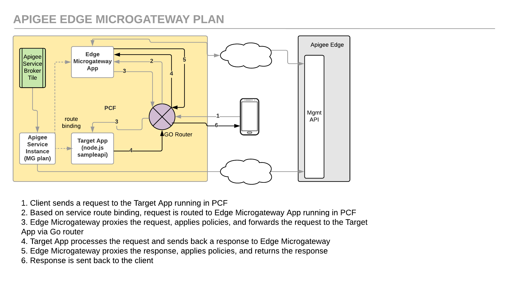

# Apigee Edge Service Broker Microgateway Plan: Secure a CF App

*Duration : 45 mins*

*Persona : API Team*

# Use case

You have an API Created in Pivotal Cloud Founday. You want to proxy it through Apigee Edge using Edge Microgateway.



# How can Apigee Edge help?

The [Apigee Edge Service Broker for PCF](https://docs.apigee.com/api-platform/integrations/cloud-foundry/install-and-configure-apigee-service-broker) enables developers to manage APIs for their PCF apps through the Apigee Edge management console.

This lab describes how to push a sample app to Pivotal Cloud Foundry (PCF), create an Apigee Edge service instance using Edge Microgateway, and bind the application to it. After binding the application to the Apigee Edge service instance, requests to the app will be forwarded to an Apigee Edge API proxy running on Edge Microgateway for management. Its the same lab as listed in [PCF documentation](https://docs.apigee.com/api-platform/integrations/cloud-foundry/proxying-cloud-foundry-app-microgateway-plan)

In the process described here, the PCF app and Edge Microgateway app are in separate Cloud Foundry containers.

# Pre-requisites

* You have [installed and configured](http://docs.pivotal.io/partners/apigee/installing.html) the *Apigee Edge Service Broker for PCF tile*. Or you got a set of credentials from your instructor that has access to a PCF environment with *Apigee Edge Service Broker for PCF* tile. 

* You have installed [cf CLI](https://docs.cloudfoundry.org/cf-cli/install-go-cli.html).

* You have an Apigee account and have access to an Apigee Org.

# Instructions

Before you begin, you will need to get the following from your PCF instance or receive them from your instructor.

YOUR-SYSTEM-DOMAIN: This the the domian/hostname where the PCF is deployed. If you are using self signed certs for this endpoint, you will have to use `--skip-ssl-validation` for some of the commands

PCF_USERNAME: PCF username

PCF_PASSWORD: PCF Password

PCF_ORG: The instance of your PCF deployment. If you are familiar with PCF, you may just refer to this as ORG. Since Apigee also as a concept of ORG, we will call this PCF_ORG for this lab

PCF_SPACE: An org can contain multiple spaces. This is the space you will pick for this lab

PCF_API: PCF API Endpoint

PCF_DOMAIN: PCF Domain for your apps. 

# Steps

**1. Push the sample application as a CF app to PCF**

   a. Clone the Apigee Edge GitHub repo:
    
    $ git clone https://github.com/apigee/cloud-foundry-apigee.git

   b. Change to the *org-and-microgateway-sample* directory of the cloned repo:
    
    $ cd cloud-foundry-apigee/samples/org-and-microgateway-sample

   c. In the *org-and-microgateway-sample* directory, edit *manifest.yml* and change the following parameters:
   
   * **name**: {your_initials}-sampleapi-mg
   * **host**: {your_initials}-sampleapi-mg
```
  applications: 
  - name: {your_initials}-sampleapi-mg
    memory: 128M 
    instances: 1 
    host: {your_initials}-sampleapi-mg
    path: . 
    buildpack: nodejs_buildpack
```
   d. Set your API endpoint to the Cloud Controller of your deployment
    
    $ cf api --skip-ssl-validation https://api.system.apigee-demo.net
```
Setting api endpoint to https://api.system.apigee-demo.net...
OK

api endpoint:   https://api.system.apigee-demo.net
api version:    2.82.0
```
   e. Log in to your deployment and select an org and a space
    
    $ cf login
    -or-
    $ cf login -u {PCF_USERNAME} -p {PCF_PASSWORD}
```
API endpoint: https://api.system.apigee-demo.net

Email> sandeepmuru+pivotal+labuser3@google.com

Password> 
Authenticating...
OK

Targeted org apigee

Targeted space sandeepmuru+pivotal+labuser3@google.com

API endpoint:   https://api.system.apigee-demo.net (API version: 2.82.0)
User:           sandeepmuru+pivotal+labuser3@google.com
Org:            apigee
Space:          sandeepmuru+pivotal+labuser3@google.com
```
   You can also select the org and space through the following command
    ```
    $cf target -o {PCF_ORG} -s {PCF_SPACE}
    ```

   f. Push the sample app to PCF

    From within the *org-and-microgateway-sample* folder run:
    
    $ cf push
    
    If successful, you should see some output from this command and finally:
```
     state     since                    cpu    memory          disk          details
#0   running   2018-04-25 02:50:40 PM   0.0%   56.3M of 600M   46.5M of 1G
```

   g. Get a list of apps to determine the URL of the app just pushed:
    
    $ cf apps
```
Getting apps in org apigee / space sandeepmuru+pivotal+labuser3@google.com as sandeepmuru+pivotal+labuser3@google.com...
OK

name                        requested state   instances   memory   disk   urls
hm-sampleapi-mg             started           1/1         600M     1G   hm-sampleapi-mg.apps.apigee-demo.net
```

   h. Use curl to send a test request to the url of the running app. Verify the response from the app. 
    
    $ curl hm-sampleapi-mg.apps.apigee-demo.net
```
{"hello":"hello from cf app"}
```

**2. Install the Apigee Broker Plugin**

   a. Run the CF install-plugin command
   
   $ cf install-plugin -r CF-Community "apigee-broker-plugin"
```
Installing plugin Apigee-Broker-Plugin...
OK
Plugin Apigee-Broker-Plugin 0.1.1 successfully installed.
```
   b. Make sure the plugin is available by running:

    $ cf -h
```
...
Commands offered by installed plugins:
  apigee-bind-mg,abm     apigee-push,ap           apigee-unbind-org,auo
  apigee-bind-mgc,abc    apigee-unbind-mg,aum     
  apigee-bind-org,abo    apigee-unbind-mgc,auc  
```

**3. Create a Service Instance**

   a. List the Marketplace services and locate the Apigee Edge service:
    
    $ cf marketplace
```
Getting services from marketplace in org apigee / space sandeepmuru+pivotal+labuser3@google.com as sandeepmuru+pivotal+labuser3@google.com...
OK

service       plans                                        description
apigee-edge   org, microgateway, microgateway-coresident   Apigee Edge API Platform
```
   b. Create an instance of the Apigee Edge service. 
   
   Select the microgateway service plan to have Apigee Edge Microgateway run in a separate container from your Cloud Foundry app.
```
   $ cf create-service apigee-edge microgateway {your_initials}_apigee_mg_service -c '{"org":"amer-api-partner19","env":"test"}'

Creating service instance hm_apigee_mg_service in org apigee / space sandeepmuru+pivotal+labuser3@google.com as sandeepmuru+pivotal+labuser3@google.com...
OK
```

   c. Use the cf service command to display information about the service instance:
```
   $ cf service {your_initials}_apigee_mg_service

Showing info of service hm_apigee_mg_service in org apigee / space sandeepmuru+pivotal+labuser3@google.com as sandeepmuru+pivotal+labuser3@google.com...

name:            hm_apigee_mg_service
service:         apigee-edge
bound apps:      
tags:            
plan:            microgateway
description:     Apigee Edge API Platform
documentation:   
dashboard:       https://enterprise.apigee.com/platform/#/
...
```

**4. Deploy Edge Microgateway onto Pivotal Cloud Foundry**

   a. Clone the Apigee Microgateway repository.
    
    $ git clone https://github.com/apigee-internal/microgateway.git
    
    $ cd microgateway
    
    $ git checkout tags/v.2.5.4
    
   b. Copy the Microgateway configuration YAML file *amer-api-partner19-test-config.yaml* from this Lab 2 */resources* folder to the *microgateway/config* directory in the Microgateway repository cloned in step c. above.
```
   $ cp resources/amer-api-partner19-test-config.yaml microgateway/config
```
   c. Edit the application manifest file *microgateway/manifest.yml* in the cloned Edge Microgateway repository to update the following env values: (Replace {your-initials} with your own). Leave the other values as-is.
```
applications:
- name: {your-initials}-edgemicro-app
  memory: 512M
  instances: 1
  host: {your-initials}-edgemicro-app
  path: .
  buildpack: nodejs_buildpack
  env: 
    EDGEMICRO_KEY: '6f10ad9a16f85a14fa8c8595cf7cf39b7c3432bb8135a95af56ffe0776454eaf'
    EDGEMICRO_SECRET: '94102b540cc60aed1a6737f476c3cbcef5bf2d8a1a2a3273dc32e24cda990d05'
    EDGEMICRO_CONFIG_DIR: '/app/config'
    EDGEMICRO_ENV: 'test'
    EDGEMICRO_ORG: 'amer-api-partner19'
    NODE_TLS_REJECT_UNAUTHORIZED: '0'
```
   d. Finally push the Edge Microgateway as its own cloud foundy app to PCF. Run cf push from within the microgateway folder of the cloned repository.
    
    $ cf push
```
...
     state     since                    cpu    memory         disk         details
#0   running   2018-04-26 10:41:17 AM   0.0%   952K of 512M   1.3M of 1G
```

**5. Bind the Sample CF App created in Step 1 to route its requests to the Apigee Egde Service Instance created in Step 3.**

   The apigee-bind-mg command creates a proxy for you and binds the app to the service.

    $ cf apigee-bind-mg --app {your_sample_app_name} --service {your_mg_service_instance} --apigee_org amer-api-partner19 --apigee_env test --micro {your_edgemicro_app_name}.apps.apigee-demo.net --domain apps.apigee-demo.net --user sandeepmuru+pivotal+labuser3@google.com --pass Apigee123

   The above command will promt for these entries. Enter the values as listed below:

   Action to take ("bind", "proxy bind", or "proxy") [required]: proxy bind
   Target application protocol [optional]: https

**6. Test the binding**
   
   Once you’ve bound your app’s path to the Apigee service (creating an Apigee proxy in the process), you can try it out with the sample app.

   From a command line run the curl command you ran earlier to make a request to your Cloud Foundry app you pushed, such as:
```
   $ curl http://{your_sample_app_name}.apps.apigee-demo.net

{"error":"missing_authorization","error_description":"Missing Authorization header"}
```
    You should see an validation error as edge micro is checking for security! 
	
**7. Test the binding again**
   
   In order to fix the error from the previous step, you need an API key.
	
   a. To get an API Key, go to Management UI, create an API Product add `edgemicro-auth` and `edgemicro_cf-{your_initials}_helloapi.YOUR-SYSTEM-DOMAIN` API Proxies to it. Create an APP and get a Key. 
	
   b. Come back to the CF CLI to restart the edge micro app, for it to get the latest API Products.

	$ cf apps
	
    $ cf restart {your_initials}-edgemicro-app

   c. Resend the request to your app this time passing the apikey as a request header.
    
    $ curl http://{URL OF YOUR APP} -H "x-api-key: {api-key}"
    
    NOTE: If curl hangs on this command, use the Postman client to make the request.
```
    {“hello”:“hello from cf app”}
```

**8. Extra credit**
    
    Login to [https://apigee.com/edge](https://apigee.com/edge)
    
    Go to API Proxies. You should see an API Proxy created by the PCF Service Broker- with the following name `edgemicro_cf-{your_initials}_helloapi.YOUR-SYSTEM-DOMAIN`
	
	You will also see `edgemicro-auth` API Proxy. Where requests are sent to for authentication. As edge microgateway does validation, you can see the validation calls coming to this API Proxy
    
    Select the API and select `TRACE` tab on the top right
    Click on the `Start Trace Session`, the green button on the top left
	Send a request to the same endpoint, as you did in step 2 
	
	$ curl https://{URL OF YOUR APP}"
      
    If you forgot the URL OF YOUR APP, you can get if through the following command (the output will have a urls section corresponding to your app)

    $ cf apps
    
**Congratulations!**...
    
    What does this mean
    - You have analytics across all your APIs, created through PCF
    - You can add authentication, traffic management and few more directly from your cf CLI, without logging into Apigee
    - When you do that the business teams can create API Products, and scale the consumption
    - If you have swagger spec for this API, you can enable your developers to access these APIs through smartdocs

# Summary

In this lab you have added API Management to an API created in PCF using Apigee Edge Microgateway.

# References

* [Installing Apigee Edge Service Broker for PCF tile]
    (http://docs.pivotal.io/partners/apigee/installing.html)


