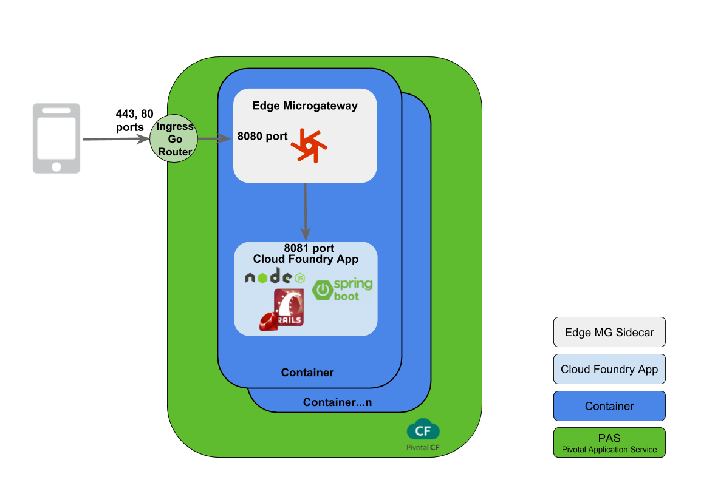
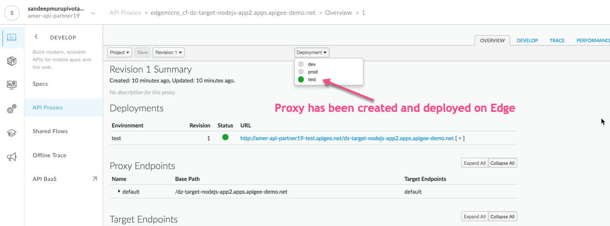
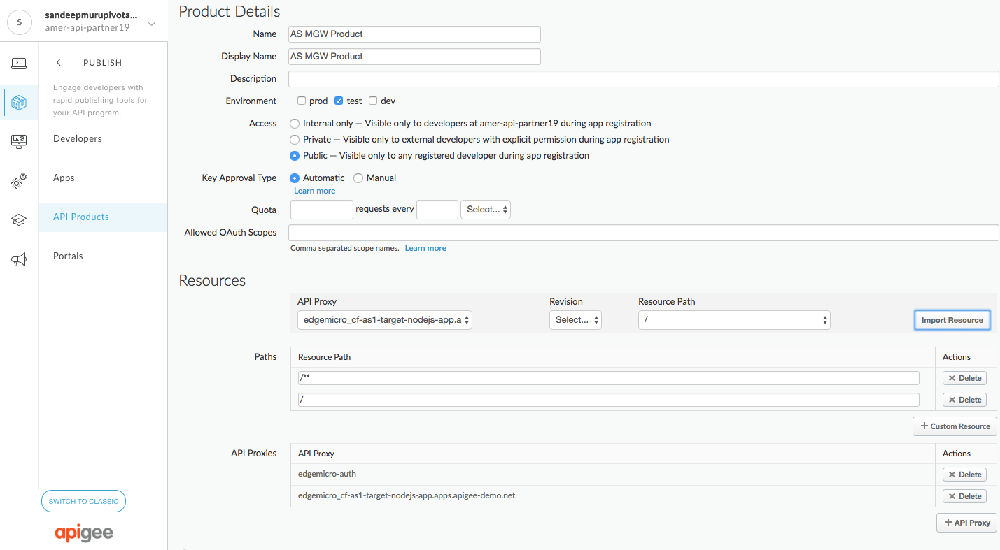
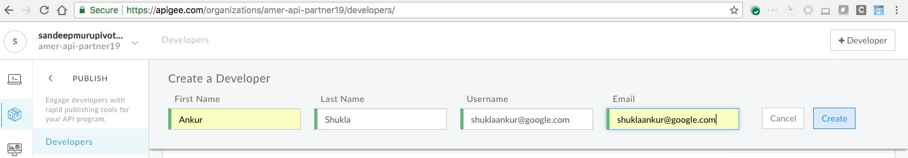
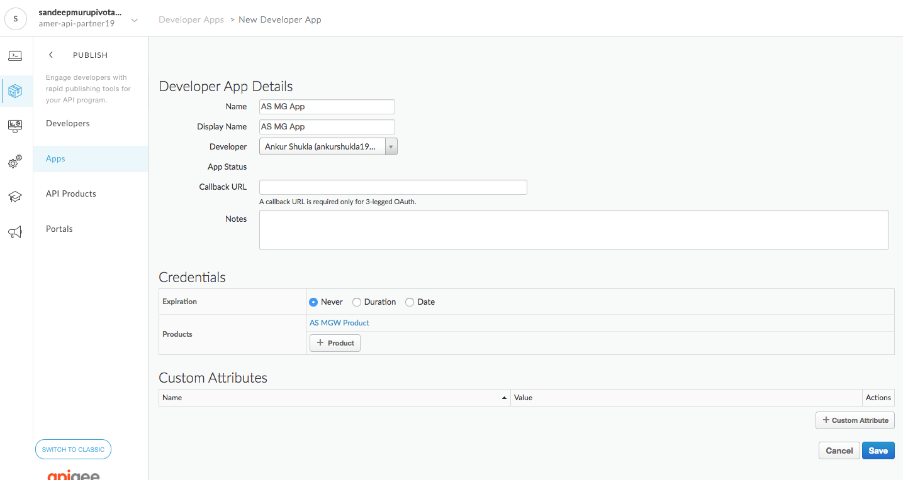
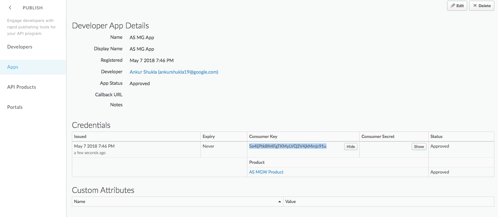

# Apigee Edge Service Broker Microgateway Coresident Plan: Secure a CF App

*Duration : 45 mins*

*Persona : API Team*

# Use case



# How can Apigee Edge help?

TODO

# Pre-requisites

* You have [installed and configured](http://docs.pivotal.io/partners/apigee/installing.html) the *Apigee Edge Service Broker for PCF tile*. Or you got a set of credentials from your instructor that has access to a PCF environment with *Apigee Edge Service Broker for PCF* tile. 

* You have installed [cf CLI](https://docs.cloudfoundry.org/cf-cli/install-go-cli.html) in your laptop. Alternatively, you can use Google Cloud Shell to [install cf cli following these steps](https://gist.github.com/dzuluaga/a5f42e343dad0198d052df8b2c35a45e).

* You have an Apigee account and have access to an Apigee Org. For PCF One Environment, pick up credentials [APIGEE_LOGIN, APIGEE_USERNAME, and APIGEE_PASSWORD here](https://apigeespringone.page.link/registration).

# Instructions

**1. Register to obtain PCF Credentials:** Open [registration sheet](https://apigeespringone.page.link/registration
), pick a user and complete additional fields: name, role, email, and company.

**2. Set environment variables:** Before you begin, you will need to set the environment variables of your PCF foundation. Please ask your instructor to provision them. Replace values of **`PCF_USERNAME, PCF_PASSWORD, APIGEE_ORG, APIGEE_ENV, APIGEE_USERNAME, APIGEE_PASSWORD, `**,  variables.

   **a. Save apigee-pcf-environment.sh** 
   
   ```bash
   # apigee-pcf-environment.sh file
   #
   # e.g. apigee-pcf-user-XXX -  where XXX is your unique identifier
   export PCF_USERNAME=apigee-pcf-user-XXX
   export PCF_PASSWORD=SomePass$word
   
   # Apigee Credetials from registration sheet above
   export APIGEE_ORG=LOOKUP_IN_SPREADSHEET_ABOVE
   export APIGEE_ENV=LOOKUP_IN_SPREADSHEET_ABOVE
   export APIGEE_USERNAME=LOOKUP_IN_SPREADSHEET_ABOVE
   export APIGEE_PASSWORD=LOOKUP_IN_SPREADSHEET_ABOVE
   export EDGEMICRO_KEY=LOOKUP_IN_SPREADSHEET_ABOVE
   export EDGEMICRO_SECRET=LOOKUP_IN_SPREADSHEET_ABOVE

   # The instance of your PCF deployment. If you are familiar with PCF, you may just refer to this as ORG. Since Apigee also as a concept of ORG, we will call this PCF_ORG for this lab and your ORG for this lab is called - "group-apigee"
   export PCF_ORG=group-apigee

   # An org can contain multiple spaces. The space you will pick for this lab is called - "apijam"
   export PCF_SPACE=apijam

   # PCF API Endpoint - e.g. - https://api.run.pcfone.io
   # This the the domain/hostname where the PCF is deployed. If you are using self signed certs for this endpoint, you will have to use `--skip-ssl-validation` for some of the commands
   export PCF_API=https://api.run.pcfone.io

   # PCF Domain for your apps.  // e.g. - apps.pcfone.io
   export PCF_DOMAIN=apps.pcfone.io
   
   #
   export PCF_ORG_SERVICE_INSTANCE=apigee-org-service
   export PCF_COR_SERVICE_INSTANCE=apigee-coresident-service
```
   
   **b. run `source apigee-pcf-environment.sh` to see these environment variables.** 

# Steps

**1. Push the sample application as a CF app to PCF**

   a. Clone the Apigee Edge GitHub repo:
    
    $ git clone https://github.com/apigeekdemos/cloud-foundry-apigee.git

   b. Change to the *org-and-microgateway-sample* directory of the cloned repo:
    
    $ cd cloud-foundry-apigee/lab3-coresident-plan/

### 3.c In the coresident-sample directory, open manifest.yml.

### 3.d Edit manifest.yml to change the name and host properties to values specific to your deployment. See the following example:

```yaml
---
applications:
- name: {your_initials}-sample-coresident-app
  memory: 1G
  instances: 1
  health-check-type: http
  health-check-http-endpoint: /healthcheck
  path: .
  env:
    #APIGEE_MICROGATEWAY_PROXY: edgemicro_cf-test.local.pcfdev.io
    #APIGEE_MICROGATEWAY_CUST_PLUGINS: ./plugins
    #APIGEE_MICROGATEWAY_PROCESSES: 2
    APIGEE_MICROGATEWAY_CONFIG_DIR: ./config
    APIGEE_MICROGATEWAY_CUSTOM: |
                                {"policies":
                                  {
                                  "spikearrest":
                                    {
                                      "allow": 10,
                                      "timeUnit": "minute"
                                    }
                                  },
                                "sequence": ["healthcheck", "oauth", "spikearrest"]
                                }
```

To support Cloud Foundry application health check, make sure your applications block includes the health-check-type and health-check-http-endpoint properties:

```yaml
health-check-type: http
health-check-http-endpoint: /healthcheck
```

Also, observe that sequence property includes a reference to the healthcheck plugin, as shown here:

```yaml
"sequence": ["healthcheck", "oauth", "spikearrest"]
```
Note :- "healthcheck" should come before the "oauth" policy to ensure no tokens are required by Cloud Foundry to make healthcheck calls. For more on health check, see Using [Application Health Checks](https://docs.cloudfoundry.org/devguide/deploy-apps/healthchecks.html).

The following describes the manifest properties:


|Variable	| Description |
|---------|-------------|
|APIGEE_MICROGATEWAY_CONFIG_DIR	| Location of your Apigee Microgateway configuration directory. |
|APIGEE_MICROGATEWAY_CUST_PLUGINS	| Location of your Apigee Microgateway plugins directory. |
|APIGEE_MICROGATEWAY_PROCESSES |	The number of child processes that Apigee Microgateway should start. If your Microgateway performance is poor, setting this value higher might improve it. |
|APIGEE_MICROGATEWAY_CUSTOM |	“sequence” corresponds to the sequence order in the microgateway yaml file (this will be added on to the end of any current sequence in the microgateway yaml file with duplicates removed). </br>“policies” correspond to any specific configuration needed by a plugin; for instance, “oauth” has the ‘"allowNoAuthorization": true configuration. These policies will overwrite any existing policies in the microgateway yaml file and add any that do not yet exist.|

### 3.e. Save the edited file.

## Step 4 (Optional): Install Apigee Edge Microgateway and Cloud Foundry App

Here, you install Apigee Edge Microgateway and your Cloud Foundry app to the same Cloud Foundry container.

### 4.a. Step NOT required during API Jam as these files are provided under resources folder. Execute for generating key and secrets. [Install and configure Apigee Edge Microgateway.](https://docs.apigee.com/api-platform/microgateway/2.5.x/installing-edge-microgateway.html)

## Step 6: Check Edge Microgateway and Cloud Foundry App ports and disable oauth plugin

### 6.a Check Edge Microgateway listening on port 8080
As per [PCF requirements Applications should listen on port `8080`](https://docs.run.pivotal.io/devguide/deploy-apps/routes-domains.html#http-vs.-tcp-routes). Therefore, Edge Microgateway will frontend our Cloud Foundry app, which listens on port `8081`.

To confirm this is the case, run the following commands on the MG config file:

```bash
$ cat config/amer-api-partner19-test-config.yaml

edge_config:
edgemicro:
  port: 8080
```

**edgemicro/port is effectively listening on 8080. IMPORTANT: by default MG config file uses port 8000. So, make sure to make changes accordingly to PCF requirements.**

### 6.b. Disable oauth plugin
We will be disabling the oauth plugin on the MG config file, this is done so that the Microgatway does not manadate oauth tokens for the healthcheck calls. Oauth has alreadybeen enabled on our manifest.yaml file (see above) and the sequesce defined there will ensure that all actual API traffic is subjected to Oauth policy enforcement.

To disable oauth, we need to comment out the oauth option from within the plugin sequence (see below) within the MG config file:

```bash
$ vi config/amer-api-partner19-test-config.yaml

plugins:
    sequence: 
      #- oauth
```


### 6.c. Check Cloud Foundry App Port running on port 8081
Ensure that your Cloud Foundry app isn’t running on port 8080, nor on the port specified by the PORT environment variable.

```
$ cat server.js

var port = 8081

var webServer = app.listen(port, function () {
    console.log('Listening on port %d', webServer.address().port)
```

This looks good. Cloud Foundry app listens on port 8081.

## Step 7: Push the Cloud Foundry App to your Cloud Foundry Container

In this step Node.js target application will be pushed to PCF. We will use the apigee-push command instead of regular piush command as apigee-push option automatically injects the microgateway within the cf container for the co-resident plan to work.

Note - Please enter 'y' for the "microgateway-coresident" question, other questions are optional (can be left blank) if you are not pushing a java application.

```bash
$ cf apigee-push

Do you plan on using this application with the "microgateway-coresident" plan? [y/n] y
If you are pushing a java application, enter the path to the archive. Otherwise press [Enter]:
Specific name of application to push [optional]:
Using manifest file /Users/shuklaankur/pcf/cloud-foundry-apigee/samples/coresident-sample/manifest.yml

Creating app as-sample-co-njs in org apigee-edge-for-pcf-service-broker-org / space apigee-edge-for-pcf-service-broker-space as admin...
OK

Using route as-sample-co-njs.apps.hol.apigee-pcf-apijam.com
Binding as-sample-co-njs.apps.hol.apigee-pcf-apijam.com to as-sample-co-njs...
OK

Uploading as-sample-co-njs...
Uploading app files from: /Users/shuklaankur/pcf/cloud-foundry-apigee/samples/coresident-sample
Uploading 8.7K, 12 files
Done uploading
OK

```

## Step 7: Bind the Cloud Foundry App to the Service Instance and Restart the Target App

In this step, you bind a Cloud Foundry app to the Apigee service instance you created. The apigee-bind-mgc command creates the proxy for you and binds the app to the service. This command also gives you an option to restage your target application after binding is complete.

Each bind attempt requires authorization with Apigee Edge, with credentials passed as additional parameters to the apigee-bind-mgc command. You can pass these credentials as arguments of the apigee-bind-mgc command or by using a bearer token.

### 7.a. (Optional) If you’re using a bearer token to authenticate with Apigee Edge, get or update the token using the Apigee SSO CLI script. 

(If you’re instead using command-line arguments to authenticate with username and password, specify the credentials in the next step - 7.b.)

Another option for Cloud, although it should be your last resource if `Edge Script (approach below)`, and `acurl` fail is to [use the Apigee Management API to get a token](https://apidocs.apigee.com/api-reference/content/using-oauth2-security-apigee-edge-management-api#usingtheapitogettokens).

#### Download the Apigee Edge scripts:

```bash
$ curl https://login.apigee.com/resources/scripts/sso-cli/ssocli-bundle.zip -o "ssocli-bundle.zip"
```

#### Unzip the ssocli-bundle.zip file

This includes get_token, a script that gets or updates a token that you use to authenticate with your Apigee Edge organization. You need this token to bind the Apigee Edge route service to your app.

```bash
$ tar xvf ssocli-bundle.zip
```

#### Create a .sso-cli directory in your user directory:

$ mkdir ~/.sso-cli
Use the get_token script to create a token. When prompted, enter the Apigee Edge username and password you use to log in to your organization.

$ ./get\_token
The get_token script writes the token file into ~/.sso-cli. For more about get_token, see the Apigee documentation.

### 7.b Bind the app to the Apigee service instance with the apigee-bind-mgc command

Use the command without arguments to be prompted for argument values. To use the command with arguments, see the command reference at the end of this topic. For help on the command, type cf apigee-bind-mgc -h.


```bash
    $ cf apigee-bind-mgc --app CF_APP_NAME --service $PCF_COR_SERVICE_INSTANCE \
    --apigee_org $APIGEE_ORG --apigee_env $APIGEE_ORG --edgemicro_key $EDGEMICRO_KEY \
    --edgemicro_secret $EDGEMICRO_SECRET --target_app_route TARGET_APP_ROUTE \
    --target_app_port 8081 --action 'proxy bind' --user APIGEE_USER_NAME --pass APIGEE_PASSWORD
```

This command should return `OK`. If it returns and error, try again until you get it. This will also give you an option to re-start your application, select 'y' to start the target application and Microgatway.

**Tip: to troubleshot `cf` commands use `-v` for verbose output.**

You’ll be prompted for the following:

|Argument |	Description |
|---------|-------------|
|Apigee username	| Apigee user name. **Provided by instructor above.** Not used if you pass a bearer token with the –bearer argument.|
|Apigee password |	Apigee password. **Provided by instructor above.** Not used if you pass a bearer token with the –bearer argument.|
|Action to take	| Required. **Creates and binds (Go router registration) proxy 'proxy bind'. Don't forget single quotes.** proxy to generate an API proxy; bind to bind the service with the proxy; proxy bind to generate the proxy and bind with a single command.|
|Apigee environment (apigee_env)	|Required. **Provided by instructor above.** The Apigee environment where your proxy should be deployed.|
|Apigee organization (apigee_org)	| Required. **Provided by instructor above.**  The Apigee organization where your proxy should be created.|
|Application to bind to (app)	|Required. **Retrieve using `cf apps` use value from name column** Name of the Cloud Foundry application to bind to.|
|Microgateway key	(edgemicro_key) | Required. **Provided by instructor.** Your Apigee Edge Microgateway key.|
|Microgateway secret (edgemicro_secret)	| Required. **Provided by instructor** Your Apigee Edge Microgateway secret.|
|Service instance name to bind to (service)	| Required. **Retrieve using `cf services`** Name of the Apigee service to bind to.|
|Target application port	| Required. **Typically 8081 as per step above after `$ cat server.js` to inspect port on Node.js app.** Port for your Cloud Foundry app. This may not be 8080 nor the PORT environment variable.|
|Target application route (target_app_route)	| Required. **Retrieve using `cf apps` and copy url. Do not include protocol (http or https)** The URL for your Cloud Foundry app. This will be the suffix of the proxy created for you through the bind command.|

Example:
```bash
shuklaankur-macbookpro:lab3 shuklaankur$ cf apigee-bind-mgc --app as1-target-nodejs-app --service AS-Apigee-MGW-COR-Plan --apigee_org amer-api-partner19 --apigee_env test --edgemicro_key {EdgeMicroKey} --edgemicro_secret {EdgeMicroSecret} --target_app_route as1-target-nodejs-app.apps.apigee-demo.net --target_app_port 8081 --action 'proxy bind' --user {Apigee-username} --pass {Apigee-password}
Binding service AS-Apigee-MGW-COR-Plan to app as1-target-nodejs-app in org apigee / space sandeepmuru+pivotal+labuser4@google.com as sandeepmuru+pivotal+labuser4@google.com...
OK
TIP: Use 'cf restage as1-target-nodejs-app' to ensure your env variable changes take effect
Would you like to start your application now? [y/n] y
```
Note :  You will be promted to restart your application, select the options 'y'. To ensure duccesfull deployment, look out for message below at the end of the deployment sequence.

```bash
Successfully destroyed container

0 of 1 instances running, 1 starting
1 of 1 instances running

App started


OK

App as1-target-nodejs-app was started using this command `npm start`

Showing health and status for app as1-target-nodejs-app in org apigee / space sandeepmuru+pivotal+labuser4@google.com as sandeepmuru+pivotal+labuser4@google.com...
OK

requested state: started
instances: 1/1
usage: 1G x 1 instances
urls: as1-target-nodejs-app.apps.apigee-demo.net
last uploaded: Mon May 7 21:54:18 UTC 2018
stack: cflinuxfs2
buildpack: node.js 1.6.3 (with decorator microgateway-coresident)

     state     since                    cpu    memory       disk         details
#0   running   2018-05-07 03:13:19 PM   0.0%   960K of 1G   1.3M of 1G

```


===========TO BE REMOVED BEGIN===============

## Step 1: Create a Service Instance

### 1.a Set your API endpoint to the Cloud Controller of your deployment.

```bash
cf api --skip-ssl-validation https://api.run.pcfone.io

Setting api endpoint to api.YOUR-SYSTEM-DOMAIN...
OK
API endpoint:  https://api.YOUR-SYSTEM-DOMAIN (API version: 2.59.0)
Not logged in. Use 'cf login' to log in.
```

### 1.b Log in to your deployment and select an org and a space.

```bash
$ cf login
API endpoint: https://api.YOUR-SYSTEM-DOMAIN
Email> user@example.com
Password>
```

### 1.c List the Marketplace services and locate the Apigee Edge service:

```bash
$ cf marketplace
Getting services from marketplace in org example / space development as user@example.com...
OK

service          plans                     description
apigee-edge      org, microgateway, microgateway-coresident         Apigee Edge API Platform
```

### 1.d Create an instance of the Apigee Edge service. Select the microgateway-coresident service plan to have Apigee Edge Microgateway run in the same container as your Cloud Foundry app.

e.g. Replace INITIALS-YOUR-SERVICE-INSTANCE to something similar to dz-apigee-mg-coresident-service-instance.

```bash
$ cf create-service apigee-edge microgateway-coresident INITIALS-YOUR-SERVICE-INSTANCE -c \
'{"org":"YOUR-APIGEE-ORG", "env":"YOUR-APIGEE-ENV"}'
Creating service instance INITIALS-YOUR-SERVICE-INSTANCE in org apigee / space ...
OK
```

### 1.e Use the cf service command to display information about the service instance:

```bash
$ cf service INITIALS-YOUR-SERVICE-INSTANCE

name:            AS-Apigee-MGW-COR-Plan
service:         apigee-edge
bound apps:
tags:
plan:            microgateway-coresident
description:     Apigee Edge API Platform
documentation:
dashboard:       https://enterprise.apigee.com/platform/#/

Showing status of last operation from service dz-apigee-mg-coresident-service-instance...

status:    create succeeded
```


===========TO BE REMOVED END===============


## Step 2: Install the Plugin

### 2.a Install the Apigee Broker Plugin as follows.

```bash
cf install-plugin -r CF-Community "apigee-broker-plugin"
Searching CF-Community for plugin apigee-broker-plugin...
Plugin apigee-broker-plugin 0.1.1 found in: CF-Community
Attention: Plugins are binaries written by potentially untrusted authors.
Install and use plugins at your own risk.
OK
Plugin Apigee-Broker-Plugin successfully uninstalled.
Installing plugin Apigee-Broker-Plugin...
OK
Plugin Apigee-Broker-Plugin 0.1.1 successfully installed.
```

### 2.b Make sure the plugin is available by running the following command:

```bash
$ cf -h
…
Commands offered by installed plugins:
  apigee-bind-mg,abm      apigee-unbind-mgc,auc    enable-diego
  apigee-bind-mgc,abc     apigee-unbind-org,auo    has-diego-enabled
  apigee-bind-org,abo     dea-apps                 migrate-apps
  apigee-push,ap          diego-apps               dev,pcfdev
  apigee-unbind-mg,aum    disable-diego
```


### Step 8: Verify the API Proxy has been Deployed to the environment

Verify that proxy with proxy name edgemicro_{APP_NAME.PCF_DOMAIN} create in Edge has been deployed successfuly on the corresponding environment through [https://apigee.com/edge](https://apigee.com/edge). Remember to use Apigee username and password provided by instructor.




### Step 9: Obtain API Keys by creating a Product, Developer and App

Since the microgateway has oauth policy enforced we will need an API Key in order to pass our security validation and successfully make a call to our target application. To obtain a security key we need to create a product, developer and an developer app on Apigee Edge Portal.

#### 9.a  Create a Product
Login to Edge UI and create a API Product from the Publish - > API Product menu option.
Ensure that you select the proxy created by the service binding and also include the out-of-box proxy for microgateway oauth verification - edgemicro-auth (see screenshot below):



#### 9.b  Create a Developer (Optional)
Note:- This step is optional as you can use an existing developer for the purpose of this lab. 
To create a developer select menu options - Publish - > Developers and '+ Developer' menu option on screen (see screenshot)



#### 9.c  Create a Developer App
To create a developer select menu options - Publish - > Apps and '+ Apps' menu option on screen (see screenshot)
Note - ensure to select the API Product created above in step 9.a



#### 9.d  Obtain the Consumer Key

Open the newly created App and click on the 'Show' Option next to the 'Cunsumer Key'. This key will be needed to make your call to PCF Target App via the Microgateway.




### Step 10: Restart the Target App and Test the App Binding

#### Step 10.a Restart App

```bash
 cf restart as1-target-nodejs-app

 Restarting app as1-target-nodejs-app in org apigee / space sandeepmuru+pivotal+labuser4@google.com as sandeepmuru+pivotal+labuser4@google.com...

Stopping app...

Waiting for app to start...

name:              as1-target-nodejs-app
requested state:   started
instances:         1/1
usage:             1G x 1 instances
routes:            as1-target-nodejs-app.apps.apigee-demo.net
last uploaded:     Mon 07 May 14:54:18 PDT 2018
stack:             cflinuxfs2
buildpack:         node.js 1.6.3 (with decorator microgateway-coresident)
start command:     npm start

     state     since                  cpu    memory         disk           details
#0   running   2018-05-08T02:58:11Z   0.0%   381.8M of 1G   211.2M of 1G   

```

Once you’ve bound your app’s path to the Apigee service (creating an Apigee proxy in the process), you can try it out with the sample app.

From command line run the curl command you ran earlier to make a request to your Cloud Foundry app (see below for example):

```bash
shuklaankur-macbookpro:coresident-sample shuklaankur$ cf apps
Getting apps in org apigee / space sandeepmuru+pivotal+labuser4@google.com as sandeepmuru+pivotal+labuser4@google.com...
OK

name                    requested state   instances   memory   disk   urls
as1-target-nodejs-app   started           1/1         1G       1G     as1-target-nodejs-app.apps.apigee-demo.net
```

```bash
$ curl as1-target-nodejs-app.apps.apigee-demo.net -H 'x-api-key:5e4ljPtk8N4FgTKMyLVQ2V4jkMmjc91u'
200 OK
{"hello":"hello Diego"}
```

Note - If above command fails to execute or hangs in terminal, add -H 'Cache-Control: no-cache' to the curl call and it will not hang. You can also execute this with Postman client or similar tool.

The new proxy is now ready for you or someone on your team to add policies, define security, traffic management, and more. For more information refer to Edge Migrogateway Documentation on Apigee Docs.
