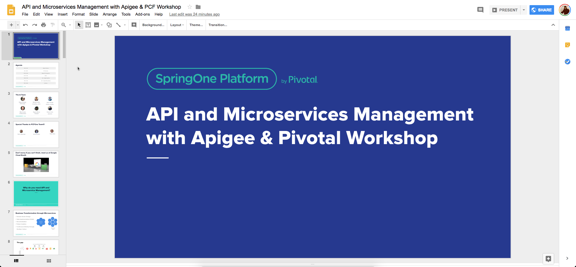

# API and Microservices Management with Apigee & Pivotal API Jam
[https://apigeespringone.page.link/labs](https://apigeespringone.page.link/labs)

This [workshop](https://springoneplatform.io/2018/workshops/apigee) was presented by Apigee and Pivotal at SpringOne Platform Conference '18.

[View slides](https://docs.google.com/presentation/d/15OwvUaZ0TGzleRgqBemGQ85Kcwq5iOp0E-ugTKMOwJg/edit?usp=sharing)

This is the supporting material for a hands-on workshop that introduces developers to Apigee integrations with Pivotal Cloud Foundry.

All of the material here is released under the [Apache 2.0 license](./LICENSE.md)

### Content
The content for this apijam includes multiple labs that use Apigee api proxy services integrated with CF apps using different service broker configurations.
* Proxy a CF app using Edge (org plan)
* Proxy a CF app using Edge Microgateway (microgateway plan)

### Primary Labs
- [1. Proxy a CF app using Edge (Org plan)](Lab%201%20-%20Proxy%20a%20CF%20app%20using%20Edge%20(Org%20plan))
    - [1.1 Traffic Management - Throttle APIs](Lab%201%20-%20Proxy%20a%20CF%20app%20using%20Edge%20(Org%20plan)/Lab%201.1%20Traffic%20Management%20-%20Throttle%20APIs)
- [2. Proxy a CF app using Edge Microgateway (Microgateway plan)](Lab%202%20-%20Proxy%20a%20CF%20app%20using%20Edge%20Microgateway%20(Microgateway%20plan))

### Additional Labs
- [1.2 API Security - Securing APIs with API Key](./addendum/Lab%201.2%20API%20Security%20-%20Securing%20APIs%20with%20API%20Keys)
- [1.3 Publishing APIs : Publish documentation](./addendum/Lab%201.3%20API%20Publishing%20-%20Documentation)
- [1.4 Consume APIs - Dev Portal](./addendum/Lab%201.4%20Consume%20APIs)

- [Addendum](./addendum). This section also contains labs that are works-in-progress or not supported.

#### Apigee Community 
If you have any questions/comments please visit [https://community.apigee.com](https://community.apigee.com/).

#### For Apigee Partners
For Apigee Partners who would like to present this API Jam, please reach out to us at [this link](https://apigeespringone.page.link/partner-request-form).
